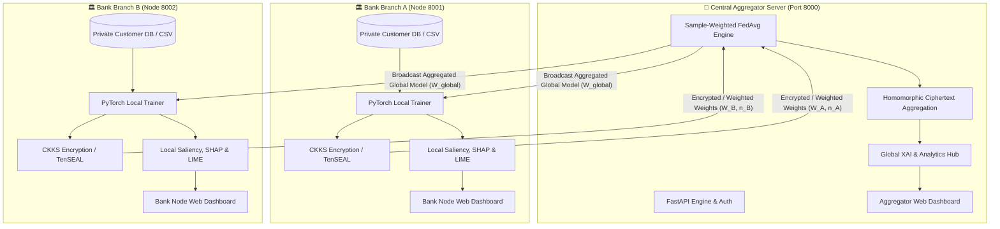

# 🏦 FedVault AI: Privacy-Preserving Federated Learning & Explainable AI for Banking Systems

[](https://www.python.org/)
[](https://pytorch.org/)
[](https://fastapi.tiangolo.com/)
[](https://vitejs.dev/)
[](https://react.dev/)
[](https://tailwindcss.com/)

**FedVault AI** is an enterprise-grade, decentralized financial machine learning ecosystem. It empowers financial institutions, regional bank branches, and fintech nodes to collaboratively train robust AI models—such as **Financial Fraud Detection** and **Credit Risk Scoring**—without ever exposing sensitive customer records, transactions, or proprietary banking data.

By fusing **Sample-Weighted Federated Averaging (FedAvg)**, **CKKS Homomorphic Encryption**, and multi-tiered **Explainable AI (XAI: Saliency, SHAP, LIME)**, FedVault AI enforces strict regulatory compliance (GDPR, GLBA, Basel III/IV) while delivering high-accuracy global model intelligence.

---

## 📑 Table of Contents

- [Core Innovations](#-core-innovations)
- [System Architecture](#-system-architecture)
- [Mathematical Foundations](#-mathematical-foundations)
- [Explainable AI (XAI) Engine](#-explainable-ai-xai-engine)
- [Homomorphic Encryption & Threat Defense](#-homomorphic-encryption--threat-defense)
- [Tech Stack](#-tech-stack)
- [Repository Structure](#-repository-structure)
- [Getting Started](#-getting-started)
  - [Prerequisites](#prerequisites)
  - [Installation](#installation)
  - [Quick Start (Unified Launcher)](#quick-start-unified-launcher)
  - [Manual Component Startup](#manual-component-startup)
- [API Reference](#-api-reference)
- [Gradient Inversion Attack Simulation (DLG)](#-gradient-inversion-attack-simulation-dlg)
- [Dashboards Overview](#-dashboards-overview)

---

## 🌟 Core Innovations

1. **🔐 Zero-Knowledge Financial Architecture**: Customer transaction records, account balances, and credit scores strictly remain inside the bank node's local database. Only encrypted model parameter deltas are transmitted.
2. **⚖️ Pure Sample-Weighted FedAvg**: Server aggregates model weights strictly weighted by the number of local transactions processed by each participating bank branch, eliminating local dataset size bias.
3. **🧠 Multi-Layer Explainable AI (XAI)**:
   - **Global Feature Importance**: First-layer weight attribution revealing macro-level risk indicators across the entire banking federation.
   - **Local Saliency & Gradient Attribution**: Micro-level sensitivity gradients indicating which customer features triggered high risk.
   - **SHAP & LIME Integration**: Full model-agnostic feature impact visualizations for high-stakes credit and fraud decisions.
4. **🛡️ TenSEAL CKKS Homomorphic Encryption**: Layer parameters and gradients can be encrypted in ciphertext, allowing the central aggregator to perform FedAvg arithmetic on encrypted tensors without decrypting them.
5. **💎 Modern Glassmorphic Dual Dashboards**: High-performance React 18 + Tailwind CSS interfaces for both Central Aggregator Governance and Bank Branch Node Operators.

---

## 🏗️ System Architecture



---

## 📐 Mathematical Foundations

### 1. Sample-Weighted Federated Averaging (FedAvg)

Let $K$ be the number of participating bank clients in a federated round. Each bank client $k$ possesses $n_k$ private records, with total transactions $N = \sum_{k=1}^K n_k$.

In round $t+1$, the central aggregator computes the new global parameter tensor $W^{t+1}$:

$$W^{t+1} = \sum_{k=1}^K \frac{n_k}{N} W_k^{t+1}$$

### 2. Global Federated Accuracy

To prevent over-weighting smaller institutions with artificially inflated local metrics, the system calculates true weighted federated accuracy:

$$\text{Accuracy}_{\text{global}} = \frac{\sum_{k=1}^K n_k \cdot \text{Accuracy}_k}{\sum_{k=1}^K n_k}$$

### 3. Local Sensitivity & Saliency (XAI)

For a customer record vector $\mathbf{x} = [x_1, x_2, \dots, x_d]^T$ and model prediction output $S_c(\mathbf{x})$ for class $c$, the local feature attribution score $A_i$ is computed via first-order input gradient backpropagation:

$$A_i = \left| \frac{\partial S_c(\mathbf{x})}{\partial x_i} \right|$$

Normalized across all $d$ features:

$$\hat{A}_i = \frac{A_i}{\sum_{j=1}^d A_j}$$

---

## 🧠 Explainable AI (XAI) Engine

| Method | Level | Description | Primary Use-Case |
| :--- | :--- | :--- | :--- |
| **Weight Magnitude Attribution** | Global | Computes average input-layer weight tensors across all hidden units | Identifies macro indicators governing the federated global model |
| **Input Gradient Saliency** | Local | Computes $\nabla_{\mathbf{x}} \mathcal{L}$ with respect to input features | Instant micro-explanations for customer risk scoring without latency |
| **Kernel / Tree SHAP** | Local & Global | Shapley value game-theoretic feature contribution estimation | Regulatory audits requiring mathematically fair credit decisions |
| **LIME Tabular Explainer** | Local | Trains a local interpretable surrogate model around the prediction | Branch officer explanation for loan/transaction denial |

---

## 🛡️ Homomorphic Encryption & Threat Defense

Unencrypted gradient transmission in standard Federated Learning is vulnerable to **Deep Leakage from Gradients (DLG)**, where an adversary inverts gradients to reconstruct private financial transactions.

```
Without Encryption:
  Client Gradients ──────> Adversary Inversion (DLG) ──────> Private Banking Records Exposed! ❌

With FedVault CKKS Encryption:
  Client Weights/Gradients ──> TenSEAL CKKS Encryption ──> Ciphertext Aggregation ──> IND-CPA Security Guaranteed ✅
```

FedVault AI integrates the **Cheon-Kim-Kim-Song (CKKS)** cryptosystem from TenSEAL, enabling:
- Polynomial addition and multiplication over encrypted vectors.
- Strict IND-CPA security: intermediate weights cannot be reversed without the bank network's private key.

---

## 💻 Tech Stack

- **Deep Learning**: [PyTorch](https://pytorch.org/) (Custom `GenericMLP` and `BankingFraudNN` with dynamic LayerNorm and Dropout)
- **Aggregator & Client API**: [FastAPI](https://fastapi.tiangolo.com/), [Uvicorn](https://www.uvicorn.org/), [Pydantic](https://docs.pydantic.dev/)
- **Security & Cryptography**: [TenSEAL](https://github.com/OpenMined/TenSEAL) (CKKS scheme), [PyJWT](https://pyjwt.readthedocs.io/), [Bcrypt](https://pypi.org/project/bcrypt/)
- **Data Engineering**: [Pandas](https://pandas.pydata.org/), [NumPy](https://numpy.org/), [Scikit-Learn](https://scikit-learn.org/)
- **Explainability**: [SHAP](https://shap.readthedocs.io/), [LIME](https://lime-ml.readthedocs.io/)
- **Frontend UI**: [React 18](https://react.dev/), [Vite](https://vitejs.dev/), [Tailwind CSS](https://tailwindcss.com/), [Lucide React](https://lucide.dev/), [Chart.js](https://www.chartjs.org/)

---

## 📂 Repository Structure

```
FedVault_AI/
├── client/                     # Bank Client Node backend & local training service
│   ├── client_app.py           # FastAPI service for local data loading, training & XAI
│   └── ...
├── client-dashboard/           # Bank Branch Node React 18 / Vite frontend
│   ├── src/
│   │   ├── App.jsx             # Client dashboard application
│   │   └── ...
│   ├── package.json
│   └── vite.config.js
├── server/                     # Central Financial Aggregator backend
│   ├── server.py               # Aggregator FastAPI server, FedAvg & user auth
│   ├── xai_utils.py            # Global & local XAI explanation engine
│   ├── fedvault_db.json        # Persistent JSON database (Users, Sessions, Rounds)
│   └── ...
├── server-dashboard/           # Central Aggregator React 18 / Vite frontend
│   ├── src/
│   │   ├── App.jsx             # Aggregator admin dashboard application
│   │   └── ...
│   ├── package.json
│   └── vite.config.js
├── core/                       # Shared modules between client and server
│   ├── models.py               # PyTorch neural network architectures (GenericMLP, BankingFraudNN)
│   ├── dataset.py              # Financial dataset processing & PyTorch DataLoaders
│   └── he_utils.py             # TenSEAL CKKS homomorphic encryption utilities
├── data/                       # Datasets & synthetic banking samples
│   └── sample_banking.csv      # Reference financial fraud / credit dataset
├── scripts/                    # Automation, simulation & security attack scripts
│   ├── run_all.py              # Unified single-command launcher (Server + Client)
│   ├── attack_simulation.py    # DLG gradient inversion attack vs CKKS HE simulation
│   ├── client.py               # Headless automated bank client simulation
│   └── main.py                 # Multi-node training orchestrator
├── requirements.txt            # Python dependencies
├── reorganization_report.md    # Historical architectural transition report
└── README.md                   # Project documentation
```

---

## 🚀 Getting Started

### Prerequisites

- **Python**: Version 3.10 or higher
- **Node.js**: Version 18 or higher & `npm`

### Installation

1. **Clone the repository**:
   ```bash
   git clone https://github.com/prathmesh-nitnaware/FedVault_AI.git
   cd FedVault_AI
   ```

2. **Create and activate a virtual environment**:
   ```powershell
   python -m venv .venv
   .\.venv\Scripts\Activate.ps1
   ```

3. **Install Python dependencies**:
   ```bash
   pip install -r requirements.txt
   ```

4. **Build Frontend Dashboards (Optional if running pre-built static bundles)**:
   ```bash
   # Server Dashboard
   cd server-dashboard
   npm install && npm run build
   cd ..

   # Client Dashboard
   cd client-dashboard
   npm install && npm run build
   cd ..
   ```

---

### Quick Start (Unified Launcher)

Launch both the **Financial Aggregator Server** and the **Bank Client Node** with a single command:

```powershell
python scripts/run_all.py
```

- **Central Aggregator Dashboard**: [http://localhost:8000](http://localhost:8000)
- **Bank Node Dashboard**: [http://localhost:8001](http://localhost:8001)

---

### Manual Component Startup

#### 1. Start the Central Aggregator Server
```powershell
cd server
uvicorn server:app --host 0.0.0.0 --port 8000 --reload
```

#### 2. Start a Bank Branch Client Node
```powershell
cd client
uvicorn client_app:app --host 0.0.0.0 --port 8001 --reload
```

*(To run multiple bank branches simultaneously, launch additional instances specifying `--port 8002`, `--port 8003`, etc.)*

---

## 🔌 API Reference

### Central Aggregator (`http://localhost:8000`)

| Method | Endpoint | Description |
| :--- | :--- | :--- |
| `POST` | `/api/auth/register` | Register a new banking administrator account |
| `POST` | `/api/auth/login` | Authenticate and obtain JWT bearer token |
| `GET` | `/api/model/global` | Download current global model weights and metadata |
| `POST` | `/api/model/upload` | Upload local bank model weights, sample count & metrics |
| `POST` | `/api/aggregate` | Trigger Sample-Weighted FedAvg aggregation across collected weights |
| `GET` | `/api/analytics` | Fetch federated round history, active nodes, and convergence curve |
| `GET` | `/api/xai/global` | Compute global feature importance of current global model |

### Bank Client Node (`http://localhost:8001`)

| Method | Endpoint | Description |
| :--- | :--- | :--- |
| `POST` | `/api/upload-dataset` | Ingest local banking CSV or Excel file |
| `GET` | `/api/load-sample` | Load built-in sample banking dataset |
| `POST` | `/api/train` | Execute local PyTorch training epochs with configurable hyperparams |
| `POST` | `/api/send-to-server` | Transmit trained weights (or HE ciphertext) to aggregator |
| `POST` | `/api/pull-global` | Pull and synchronize latest global model from aggregator |
| `POST` | `/api/predict` | Run instant fraud inference with Saliency, SHAP, and LIME explanations |

---

## ⚔️ Gradient Inversion Attack Simulation (DLG)

FedVault AI includes a verification script demonstrating how **Deep Leakage from Gradients (DLG)** fails against **Homomorphic Encryption**:

```powershell
python scripts/attack_simulation.py
```

### What this script tests:
1. **Unencrypted Channel**: An adversary intercepts raw PyTorch gradients and runs continuous gradient optimization $\min \|\nabla W_{\text{dummy}} - \nabla W_{\text{real}}\|^2$ to iteratively reconstruct the customer's private financial data.
2. **Encrypted Channel (CKKS)**: The same payload is encrypted into a TenSEAL CKKS ciphertext vector. The adversary cannot formulate gradient graphs without the private key, ensuring zero data leakage.

---

## 🖥️ Dashboards Overview

### 1. Central Aggregator Dashboard (`:8000`)
- **Live Node Monitor**: Real-time status of connected bank branches and weight sync states.
- **Convergence Analytics**: Round-by-round Loss and Sample-Weighted Federated Accuracy graphs.
- **Global Feature Attribution**: Dynamic visual charts displaying the ranking of key financial features (e.g., `CreditScore`, `Balance`, `TxnAmount`).

### 2. Bank Client Dashboard (`:8001`)
- **Data Ingestion & Preprocessing**: Upload customer data, preview distributions, and perform automatic standard scaling.
- **Local Training Studio**: Real-time epoch loss tracking, validation accuracy, and batch training.
- **Model Synchronization**: One-click upload to the federation and one-click global model pull.
- **Live Decision & Explainability (XAI)**: Interactive customer risk assessment calculator with visual feature saliency breakdowns.

---

## 👥 Authors & Acknowledgments

- **Lead Developer**: [prathmesh-nitnaware](https://github.com/prathmesh-nitnaware)
- **Domain**: Privacy-Preserving Machine Learning (PPML), Banking Systems Governance, Federated Learning & Explainable AI (XAI).
